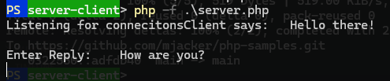
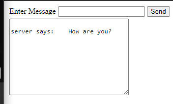

# Steps to follow.

Video reference [here](https://www.youtube.com/watch?v=75CCxIBs4Ak)

1. run from terminal the server.php file
`php -f .\server.php`
> If Fatal error: "Undefined funciton socker_created() ocurred:
> need to enable `extension=sockets` from apache config-xampp->php.ini

2. open client.php from xampp server.
